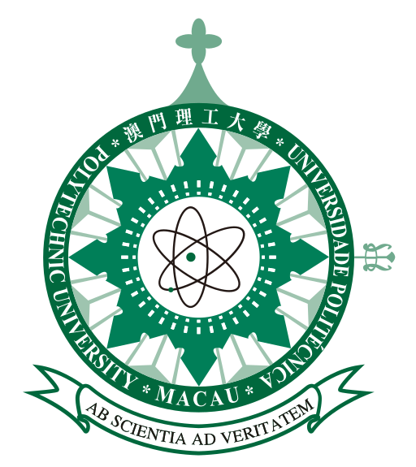

# Personalized Neoadjuvant Therapy Recommendations in Breast Cancer from an Explainable Multi-Omics Response Model
We developed and externally validated a multi-omics model integrating pre-NAT clinical data, DCE-MRI images, and medical reports to predict pathologic complete response (pCR) and likelihood of survival after NAT. The prognostic scores provided by the response model can select populations with relatively poor outcomes after treatment according to the factual regimen, which may provide a basis for personalized NAT regimen recommendations, potentially reducing inefficiency or overtreatment by moving beyond selection solely based on cancer stage and subtype.

## Environment Setup
Start by installing conda environment, then clone this repository and install the dependencies.

```sh
conda create -n morm python=3.11
conda activate morm

pip install torch torchvision torchaudio

git clone https://github.com/fiy2W/MORM.git
cd morm

pip install -r requirements.txt
```

## How to get started?

### Prepare data

### Multi-omics alignment pretraining
We use contrastive language-image pretraining (CLIP) to align MRI images and medical reports.
```sh
python src/train/pretrain_clip.py -c config/config.yaml -d cuda
```

### Train
Train PoE model with five-fold cross validation.
```sh
python src/train/train_vae_poe.py -c config/config.yaml -d cuda -f 0
python src/train/train_vae_poe.py -c config/config.yaml -d cuda -f 1
python src/train/train_vae_poe.py -c config/config.yaml -d cuda -f 2
python src/train/train_vae_poe.py -c config/config.yaml -d cuda -f 3
python src/train/train_vae_poe.py -c config/config.yaml -d cuda -f 4
```

### Test
Test model for pCR prediction and survival analysis.
```sh
python src/test/test_vae_poe_pcr.py -c config/config.yaml -d cuda
python src/test/test_vae_poe_followup.py -c config/config.yaml -d cuda
```

## <span id = "acknowledgements">Acknowledgements</span>




## <span id = "contact">Contact</span>
For any code-related problems or questions please [open an issue](https://github.com/fiy2W/MORM/issues/new) or concat us by emails.

- [Ritse.Mann@radboudumc.nl](mailto:Ritse.Mann@radboudumc.nl) (Ritse Mann)
- [taotan@mpu.edu.mo](mailto:taotan@mpu.edu.mo) (Tao Tan)
- [Luyi.Han@radboudumc.nl](mailto:Luyi.Han@radboudumc.nl) (Luyi Han)